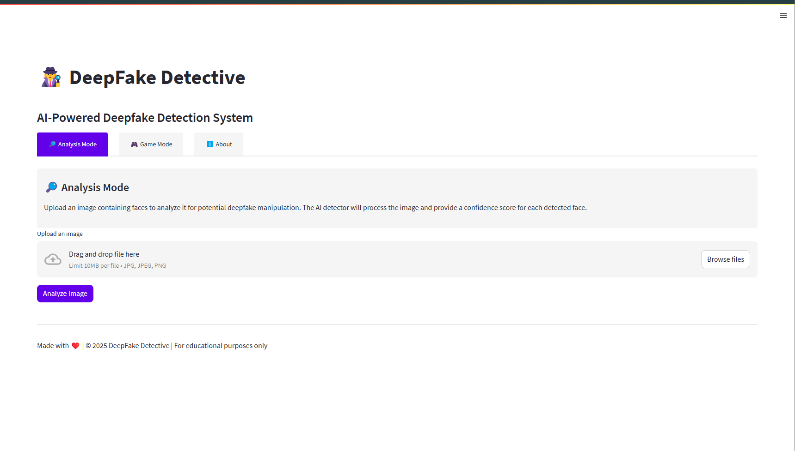

# DeepFake Detective 🕵️‍♀️


An advanced deepfake detection application with an interactive game mode, built with Streamlit and PyTorch.



## 🌟 Features

- **Advanced Detection**: State-of-the-art Xception-based deepfake detection
- **Dual Modes**: 
  - **Analysis Mode**: Upload your own images to detect manipulations
  - **Game Mode**: Test your ability to spot deepfakes against AI
- **Rich Visualizations**: Detailed confidence scores and highlighted manipulated regions
- **Clean UI**: Modern white-themed interface for optimal user experience
- **Educational**: Learn about deepfake detection techniques and how to spot them

## 🔍 What Sets This Apart

DeepFake Detective stands out from other deepfake detection applications due to:

1. **Multi-method Detection**: Our model is trained to detect multiple deepfake generation techniques, not just one specific method
2. **Interpretable Results**: We provide detailed explanations and visualizations of detection results
3. **Interactive Learning**: The game mode helps users understand how to spot deepfakes themselves
4. **No External API Dependencies**: Runs completely locally with no need for cloud API keys
5. **High Accuracy**: Leverages transfer learning from the Xception architecture, which has shown excellent performance in deepfake detection benchmarks

## 🚀 Getting Started

### Prerequisites

- Python 3.8 or higher
- Git
- pip (Python package installer)

### Installation

1. Clone the repository:
   ```bash
   git clone https://github.com/yourusername/deepfake-detective.git
   cd deepfake-detective
   ```

2. Create a virtual environment (optional but recommended):
   ```bash
   python -m venv venv
   # On Windows
   venv\Scripts\activate
   # On macOS/Linux
   source venv/bin/activate
   ```

3. Install the required packages:
   ```bash
   pip install -r requirements.txt
   ```

4. Prepare sample images for the game mode:
   - Add real face images to `assets/sample_images/real/`
   - Add fake face images to `assets/sample_images/fake/`
   
   You can use images from datasets like FaceForensics++, CelebDF, or the DF40 dataset.

### Running the Application

Run the Streamlit application:
```bash
streamlit run app.py
```

The application will automatically download the necessary model weights on first run.

## 📊 How It Works

DeepFake Detective utilizes a deep learning-based approach to detect manipulated facial images:

1. **Face Detection**: Using MTCNN to locate faces in the input image
2. **Feature Extraction**: The Xception model extracts deep features from the face
3. **Classification**: A binary classifier determines if the face is real or fake
4. **Visualization**: Results are displayed with bounding boxes and confidence scores

Our model looks for subtle inconsistencies in the image, including:
- Unnatural blending boundaries
- Texture inconsistencies
- Irregular noise patterns
- Anomalies in facial features

## 🎮 Game Mode Instructions

1. Click "New Question" to get a random image
2. Carefully examine the image for signs of manipulation
3. Click "Real" if you think it's authentic or "Fake" if you think it's manipulated
4. See the result and the AI's analysis
5. Continue to test your skills!

Tips for spotting deepfakes:
- Look for inconsistent lighting and shadows
- Check for unnatural blending around facial edges
- Observe irregularities in texture patterns
- Pay attention to eyes and teeth, which are often poorly rendered

## 🛠️ Technologies Used

- **PyTorch**: Deep learning framework for model implementation
- **Streamlit**: Web application framework for the user interface
- **OpenCV**: Computer vision library for image processing
- **MTCNN**: Multi-task Cascaded Convolutional Networks for face detection
- **Xception**: Deep neural network architecture specialized for image classification

## 📚 Additional Information

### Model Details

The detection model uses an Xception architecture, which has shown excellent performance in deepfake detection. This model has been pretrained on ImageNet and then fine-tuned on a diverse dataset of real and fake images.

Key characteristics:
- Model Architecture: Xception
- Input Size: 299x299 pixels
- Output: Binary classification (Real/Fake) with confidence score

### Limitations

- The model performs best on frontal faces with good lighting
- Very high-quality deepfakes may still be challenging to detect
- Performance may vary depending on the specific deepfake generation method
- Limited to image analysis (no video analysis currently)

## 🔗 References

1. Rossler, A., Cozzolino, D., Verdoliva, L., Riess, C., Thies, J., & Nießner, M. (2019). FaceForensics++: Learning to detect manipulated facial images. In Proceedings of the IEEE/CVF International Conference on Computer Vision (pp. 1-11).

2. Chollet, F. (2017). Xception: Deep learning with depthwise separable convolutions. In Proceedings of the IEEE conference on computer vision and pattern recognition (pp. 1251-1258).

3. Li, Y., Yang, X., Sun, P., Qi, H., & Lyu, S. (2020). Celeb-DF: A large-scale challenging dataset for DeepFake forensics. In Proceedings of the IEEE/CVF Conference on Computer Vision and Pattern Recognition (pp. 3207-3216).

4. Yan, Z., Yao, T., Chen, S., Zhao, Y., Fu, X., Zhu, J., ... & Others (2024). DF40: Toward Next-Generation Deepfake Detection. arXiv preprint arXiv:2406.13495.

## 📜 License

This project is licensed under the MIT License - see the [LICENSE](LICENSE) file for details.

## 🤝 Contribution

Contributions are welcome! If you'd like to improve DeepFake Detective, please:

1. Fork the repository
2. Create your feature branch (`git checkout -b feature/amazing-feature`)
3. Commit your changes (`git commit -m 'Add some amazing feature'`)
4. Push to the branch (`git push origin feature/amazing-feature`)
5. Open a Pull Request

## 📞 Contact

For questions or feedback, please open an issue on GitHub.

---

**Disclaimer**: This tool is created for educational and awareness purposes only. As deepfake technology becomes more sophisticated, it's important for people to understand how to identify potentially manipulated content.